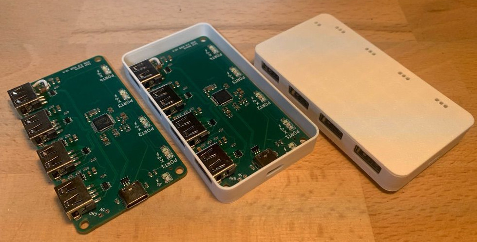
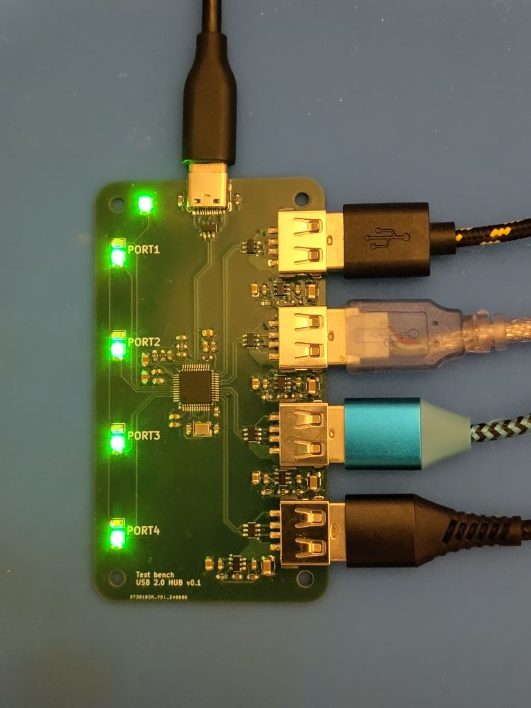
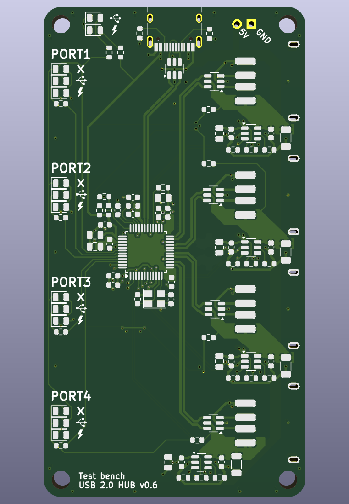

# A USB 2 Hub with per-port-power and MTT

This repository contains the [KiCad](https://www.kicad.org/) and [OpenScad](https://openscad.org/) files for a USB 2 Hub with per-port power and MTT.

The PCB design contains 4 USB-A ports and 1 USB-C port. The latter is used to connect the device to a computer.

If you want to switch power to ports you can use the provided [kernel interface](https://www.kernel.org/doc/html/latest/driver-api/usb/power-management.html#user-interface-for-port-power-control) or a userland utility such as [uhubctl](https://github.com/mvp/uhubctl).

## Case

OpenSCAD and STL files are available. These can be used to 3D print a case for the hub. The case can be assembled using M3 bolts with a maximum length of 10 mm.

## Revisions

### v0.1 minimally tested

* instead of a 100k (busb <-> gnd) on r11, solder two 100k resistors from each of r11's pads
  to each of r10's pads (busb <-> 5v & gnd <-> vbusm)

### v0.6 untested

